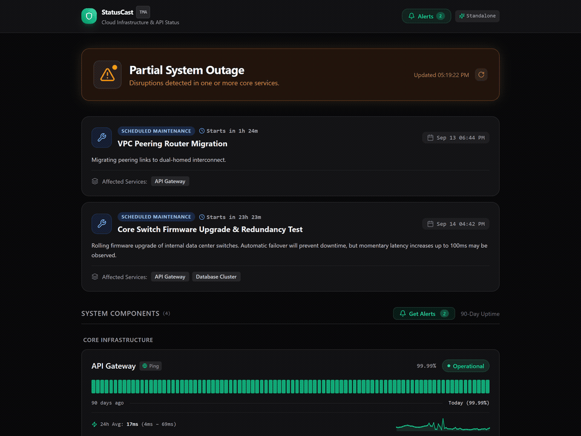
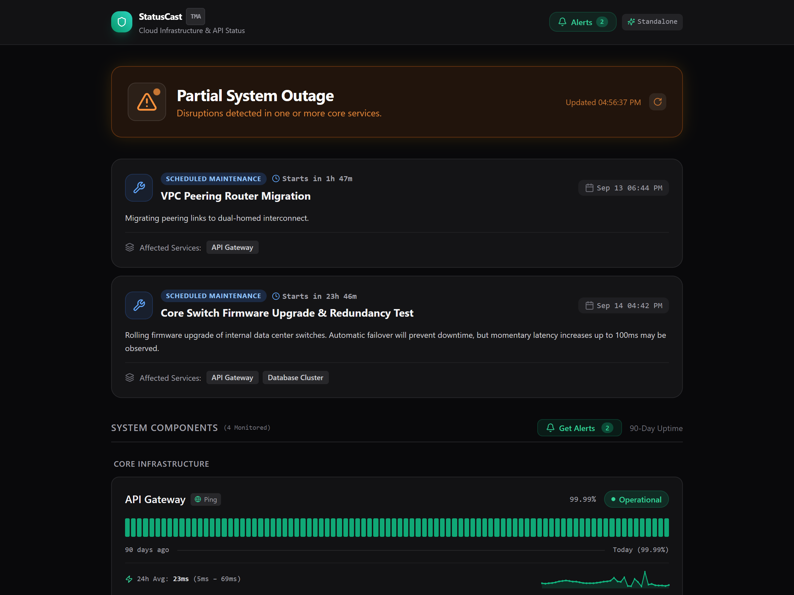
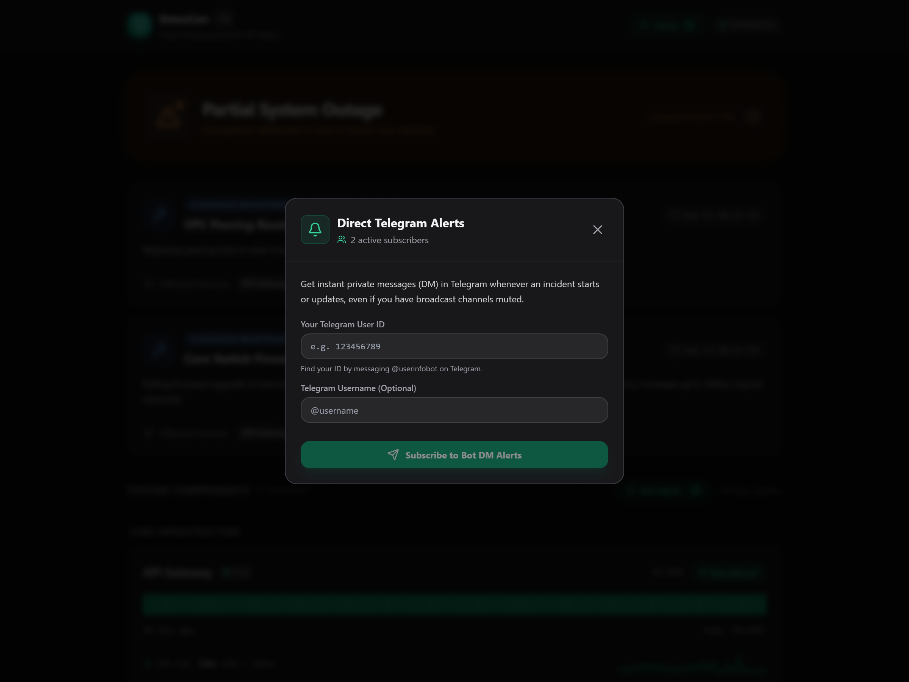
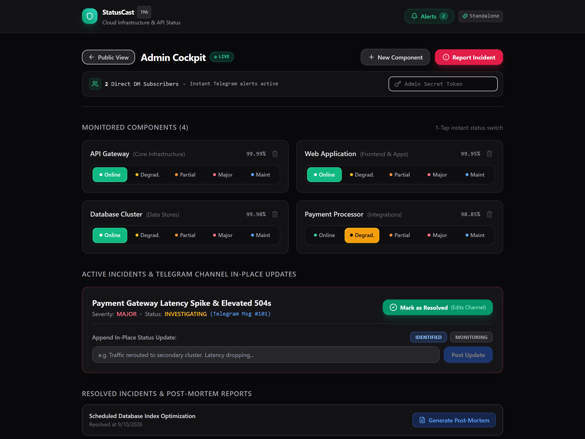
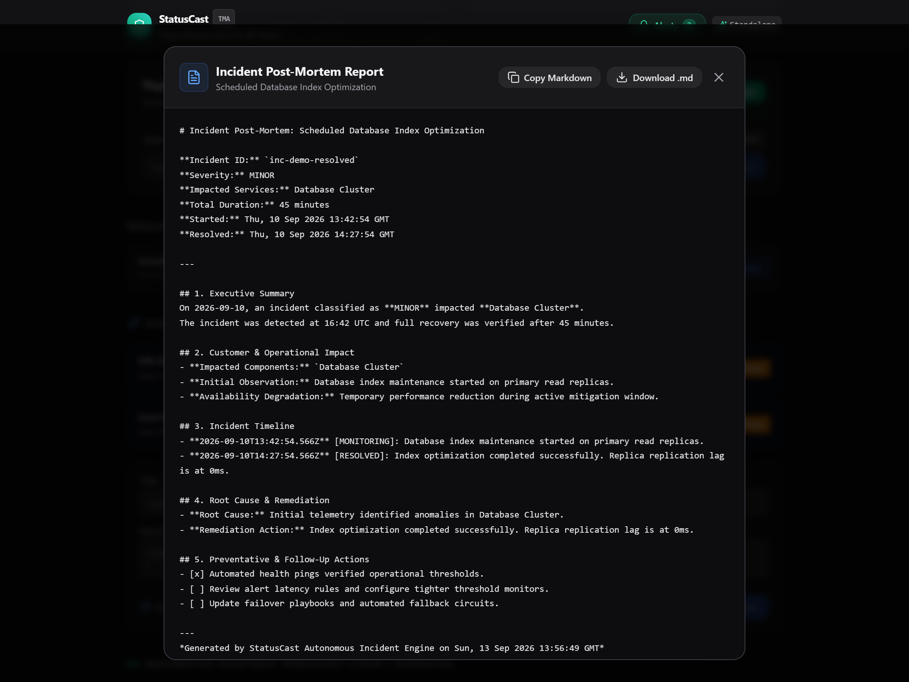
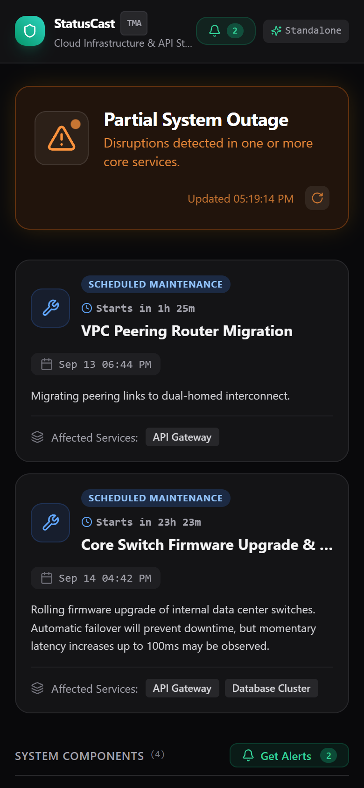
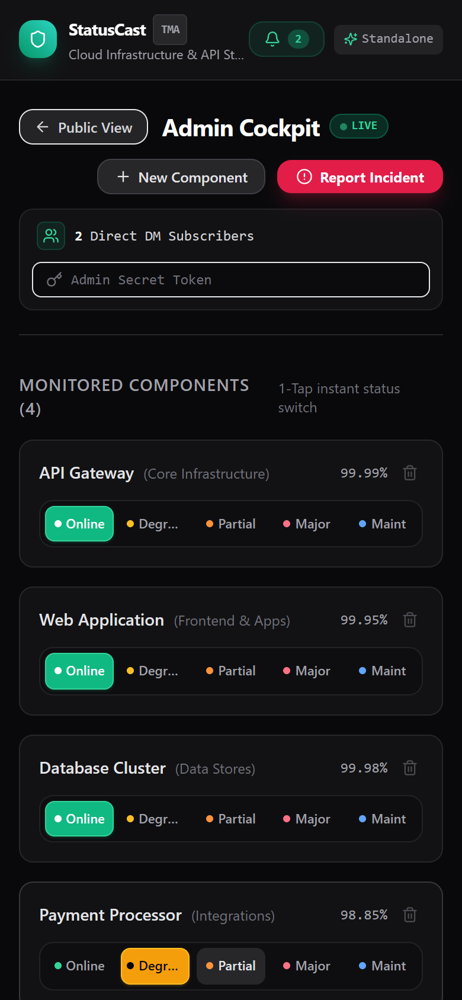

<p align="center">
  
</p>

<h1 align="center">StatusCast</h1>

<p align="center">
  <b>Telegram Mini App Status Page & In-Place Broadcast Channel Incident Telemetry</b>
</p>

<p align="center">
  
  
  
  
  
  
</p>

<p align="center">
  StatusCast is a self-hosted Telegram Mini App and incident broadcaster for Telegram channels. When incidents occur, updates and resolutions edit the original channel announcement in place, keeping public feeds clean while notifying subscribers directly.
</p>

<p align="center">
  
</p>

---

## Screenshots

| Public Status Page (Latency Sparklines & Maintenance) | Direct Bot DM Alerts Modal |
| :---: | :---: |
|  |  |

| Admin Cockpit (Component State Switcher & In-Place Updates) | Automated Incident Post-Mortem Report |
| :---: | :---: |
|  |  |

| Telegram Mini App Mobile Status (390px) | Mobile Admin Controls & Heartbeat Webhooks |
| :---: | :---: |
|  |  |

---

## Brand Mascot: The Radar Osprey

StatusCast is represented by the **Radar Osprey** (*Pandion Observator*), designed with geometric origami lines:
- **Electric Cyan Optics (`#00f5ff`)**: Active probes and instant Telegram alert delivery.
- **Obsidian and Slate Facets (`#0b0f19` to `#475569`)**: Native SQLite WAL persistence.
- **Titanium Amber Hook (`#fbbf24`)**: Incident triage and root-cause notifications.

---

## Core Features

- **Telegram Mini App Status Interface:** Displays overall system health, 90-day segmented historical uptime bars per component, and chronological incident logs.
- **In-Place Channel Broadcaster:** Sends an alert to your Telegram channel when an incident starts. Updates and resolution notes edit the original message in place, keeping your channel feed clean.
- **Direct Bot DM Alerts:** Visitors can subscribe directly via Telegram bot to receive push alerts for critical outages and maintenance notifications.
- **24-Hour Latency Sparklines:** Visualizes real-time response time curves and tracks average, minimum, and maximum response times per service.
- **Scheduled Maintenance Windows:** Advance notice banners with live countdown timers, component tagging, and automated Telegram channel notices.
- **Component Management Cockpit:** Admin interface to add, edit, or remove services with custom health check endpoints and heartbeat keepalive tokens.
- **Automated Incident Post-Mortems:** Generates structured Markdown incident review documents complete with timelines, customer impact summaries, and follow-up checklists.
- **Automated Monitoring & Heartbeats:** Built-in background health checks for HTTP endpoints and a webhook receiver (`POST /api/heartbeat/:componentId`) for cron pings.
- **Standalone Execution:** Uses Telegram long polling (`getUpdates`). Runs on a local machine without public domains, HTTPS tunnels, or external proxy requirements.
- **Demo Mode:** Pre-seeds sample services (API Gateway, Web Application, Database Cluster, Payment Processor), 90-day historical metrics, latency samples, and an active incident card.

## Architecture

```
Telegram Clients / Desktop Browsers
        │
        ▼
Telegram Mini App (React 19 + Vite + Tailwind CSS)
        │
        ▼  HTTP / REST
Fastify Backend (Node.js + TypeScript)
  ├── SQLite WAL Database (native node:sqlite)
  ├── Background Monitoring Engine (HTTP Pings & Latency Sampler)
  ├── Direct Bot DM & In-Place Broadcaster (grammY Long Polling)
  └── Incident Post-Mortem Generator
        │
        ├──► Telegram Broadcast Channel (@channel)
        └──► Telegram Subscribers (Direct Messages)
```

## Quick Start

### 1. Prerequisites

- Node.js 20 or later
- npm 10 or later
- (Optional) Docker and Docker Compose

### 2. Installation

Clone the repository and install dependencies:

```bash
git clone https://github.com/alexandrmotologa/statuscast.git
cd statuscast
npm run install:all
```

### 3. Configuration

Copy the example environment file:

```bash
cp .env.example .env
```

If you do not have a Telegram Bot token yet, keep `DEMO_MODE=true` and default mock settings. The application runs in mock mode, emulating Telegram WebApp interactions and logging broadcast messages to the console and admin cockpit.

To connect live Telegram services:
1. Open `@BotFather` in Telegram and run `/newbot` to generate a token.
2. Add your token to `TELEGRAM_BOT_TOKEN`.
3. Create a Telegram channel, add your bot as an Administrator with post and edit permissions, and set `TELEGRAM_CHANNEL_ID` in `.env`.

### 4. Running Locally

Build the frontend and start the backend:

```bash
npm run build
npm start
```

Or run frontend and backend concurrently in development mode:

Terminal 1 (Backend):
```bash
npm run dev:server
```

Terminal 2 (Frontend):
```bash
npm run dev:web
```

Open `http://localhost:8080` (or `http://localhost:8081` if port 8080 is occupied) in your browser.

## Using with Docker

Run StatusCast in a container with persistent SQLite storage:

```bash
docker compose up -d --build
```

Access the status page at `http://localhost:8080`.

## API Endpoints

### Public Endpoints
- `GET /api/status/:pageId`: Component health, 90-day daily uptime data, 24h latency history, and incident logs.
- `GET /api/status/:pageId/badge`: SVG status badge for GitHub READMEs.
- `POST /api/subscriptions/subscribe`: Subscribe a Telegram user to direct alert notifications.
- `POST /api/subscriptions/unsubscribe`: Remove user from direct alert notifications.
- `GET /api/subscriptions/:pageId/status`: Check if a user is subscribed.
- `GET /api/incidents/:id/post-mortem`: Retrieve generated markdown post-mortem report for an incident.
- `GET /health`: Service readiness probe.

### Admin Endpoints (Requires `X-Admin-Secret` header or Telegram WebApp authentication)
- `POST /api/components`: Create a new monitored service component.
- `PUT /api/components/:id`: Update component operational status and metadata.
- `DELETE /api/components/:id`: Delete a monitored component.
- `POST /api/incidents`: Create an incident and broadcast to the Telegram channel.
- `PATCH /api/incidents/:id`: Append an update or mark an incident as resolved (edits channel post in place).
- `POST /api/maintenance`: Schedule a maintenance window and notify channel/subscribers.
- `PATCH /api/maintenance/:id`: Update maintenance status (SCHEDULED, IN_PROGRESS, COMPLETED, CANCELLED).

### Heartbeat Endpoints
- `POST /api/heartbeat/:componentId`: Accept external keepalive pings from cron jobs or servers.

Detailed endpoint documentation is in [docs/api-reference.md](docs/api-reference.md).

## Project Structure

```
statuscast/
├── server/
│   ├── src/
│   │   ├── bot/           # grammY bot and in-place broadcaster
│   │   ├── db/            # SQLite schema, migrations, and demo seeder
│   │   ├── routes/        # Public, Admin, and Heartbeat REST APIs
│   │   ├── security/      # Telegram WebApp initData HMAC validator
│   │   ├── services/      # Background HTTP pinger and monitor worker
│   │   └── index.ts       # Fastify server entrypoint
│   └── package.json
├── web/
│   ├── src/
│   │   ├── components/    # Uptime bars, status banners, incident timelines
│   │   ├── views/         # PublicStatusView and AdminCockpitView
│   │   ├── hooks/         # useTelegram and status data hooks
│   │   └── App.tsx
│   └── package.json
├── docs/                  # Architecture and API documentation
├── docker-compose.yml
├── Dockerfile
└── README.md
```

## Testing

Run backend tests:

```bash
npm test
```

## Contributing

Please see [CONTRIBUTING.md](CONTRIBUTING.md) for contribution workflow and code style guidelines.

## License

MIT